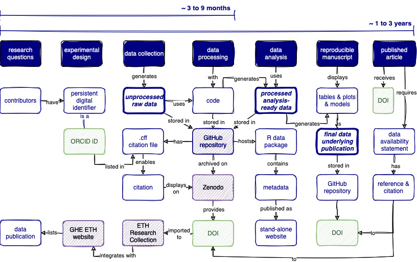
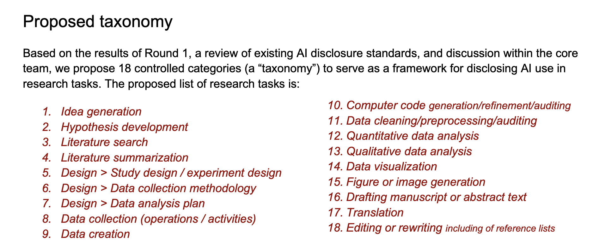

```{r}
#| echo: false
library(knitr)
library(dplyr)
library(readr)
library(stringr)
library(countdown)
```

# Welcome  {background-color=""}

<!--
Combined layout: the whole path twice, with the studio cards inside sprint 1.
Every slide from the lesson plan is placed with its headline, turn type,
icons, countdown and a notes stub. Body text is a placeholder where it says
so. Demo scripts live in lesson-plan.qmd, not here. The question sheet, the
cards and the day sheet live on studio-cards.qmd and are printed for the day.
Countdown minutes equal the minute tables in lesson-plan.qmd. Every prompt a
learner types is also in element-prompts.md, for the chat room. This comment
sits below the first heading: above it, it made an empty slide after the
title.
-->

## Welcome back

::: incremental
-   In July you learned the workflow: clone, commit, branch, pull request, review, merge.
-   Today one new participant joins that workflow: [a coding agent]{.highlight-yellow}.
-   Subject matter expertise now matters more than programming skill.
:::

::: {.notes}
Say the opening claim once and move on. The two rules follow on their own slide.
:::

## Two room rules

::: {.rule style="margin-top: 0.6em;"}
1. Never make another human read AI slop.
:::

Read everything it does. Tell humans what you want feedback on. Every round ends with the same question: would I merge this?

::: {.rule style="margin-top: 0.8em;"}
2. Commit often.
:::

A commit is a checkpoint you can return to and a line in the record. Today: [a commit after every run that changed a file]{.highlight-yellow}, one pull request per sprint.

::: {.notes}
Minute three. Both rules come back all day: rule one at every "would I merge this?", rule two at the end of every Your turn.
:::

##  Spectrum line

::: task
Stand along the tape line.

1.  Left end: never used AI for research. Right end: use Claude Code every day.
2.  Two voices from each end.
3.  Re-sort: how much do you trust the output? Two voices again.
:::

```{r}
#| echo: false
countdown(minutes = 8)
```

::: {.notes}
First movement of the day, before any slide with content. The trust re-sort is the one to listen to.
:::

## The goal today

::: incremental
-   The goal today is [not a finished data analysis]{.highlight-yellow}.
-   The goal is the same level for everyone: working with Claude Code and the ideas behind it, such as plan mode, issues, review, CLAUDE.md, skills and the record.
-   For some of you the tool is new. Some of you already use these ideas.
-   Already experienced? You are welcome to explore further, but follow the instructions first.
:::

::: {.notes}
Right after the spectrum line, while the room has just seen how wide it is. Two minutes.
:::

## Four questions {.compact}

::: incremental
-   **What must never go in?** The agent reads whole folders. Personal and sensitive data never go into a repository, private ones included.
-   **How do I know this is right?** Most useful on work you could have done yourself, least trustworthy where you cannot check it [@doctorow2026discernment].
-   **Could I recreate it if the AI were gone?** Fine that the AI made it. A problem when it has to stay in the loop for you to change it.
-   **What do I say, and to whom?** Declare the tool as a method. Do not cite the model as a source.
:::

::: {.fragment style="text-align: center; margin-top: 0.5em;"}
With your neighbour, two minutes each: which one worries you most, and why?
:::

```{r}
#| echo: false
countdown(minutes = 4)
```

::: {.notes}
The arguments are on the four background pages. Two minutes per partner, the pairs swap on their own, no share-out; the questions return in the disclosure block.
:::

## How the day works {.compact}

::: incremental
-   The same path [twice]{.highlight-yellow}: question, agent, commits, pull request, release.
-   **Sprint 1**, before lunch: three questions of your own, one framed run, then [studio cards]{.highlight-yellow} on your repository with a commit after each, a pull request you merge yourself, release v0.1.0. Fast and rough, on purpose.
-   **Sprint 2**, after lunch: a plan you edit, issues a colleague reviews, a run that continues from your phone, a reviewed pull request, a CLAUDE.md, release v0.2.0, one declaration over both.
-   Every round ends with the same check: [would I merge this?]{.highlight-yellow} Today, we merge.
-   Two snack breaks, each with a question to take with you. The day closes with a zine.
:::

## The variable {.smaller}

::: {.small}
| Round | Who reads the files | Who decides the steps | Who reviews | Where the instructions live | Where the result lives |
|---|---|---|---|---|---|
| 0 No AI | you | you | nobody | your head | a Word file on your laptop |
| 1 Chat | you paste them | you | you | the chat box | [a chat thread in your account]{.highlight-yellow} |
| 2 One line, sprint 1 | the agent | the agent | you, afterwards | one line | [files and a commit in your repository]{.highlight-yellow} |
| 3 Plan mode, sprint 2 | the agent | you, before anything runs | you | a plan you can edit | a plan file, then commits |
| 4 Issues and review | the agent | you and a colleague | a colleague, twice | GitHub issues | a reviewed pull request |
| 5 CLAUDE.md and skills | the agent | you and a colleague | a colleague | the repository | a tagged release |

: {tbl-colwidths="[15,14,17,14,18,22]"}
:::

::: {.notes}
This table returns as one row per section slide, with the changed cell highlighted. Sprint 1 is rows 1 and 2, sprint 2 is rows 3 to 5. The last column is the one to point at: rounds 1 and 2 differ most in where the result ends up.
:::

## Two rungs today

::: incremental
1.  Very low stakes: implement it. [Sprint 1.]{.highlight-yellow}
2.  Low stakes: plan, then implement.
3.  Medium stakes: plan, review the plan, implement, review the implementation. [Sprint 2.]{.highlight-yellow}
4.  High stakes: design first, then repeat the cycles.
:::

::: {.fragment}
::: {.callout-note}
The workflow is not the same for every task. Which rung a task gets is the first decision, every time. 
:::
:::

::: {.notes}
Hadley Wickham's stakes ladder, the reason plan mode exists. Two minutes. The note appears after the last rung.
:::

## Learning objectives {.compact}

By the end of this workshop, you will be able to:

::: incremental
1.  **Run an agent inside the Git workflow**: give it a task, have the plan reviewed and written as issues before any code exists, then review the pull request and accept or reject it.
2.  **Judge the difference a plan makes**: compare one line against a reviewed plan, and say what changed and why.
3.  **Judge the difference documentation makes**: a plain CSV against a data package, a bare repository against one with a template, a codebook and a CLAUDE.md.
4.  **Declare agent use**: point to the record your workflow produced, up to a tagged release, and say what it shows.
:::

::: {.notes}
Placeholder wording; the website objectives are the source of truth once reworded. Objective 2 is two releases side by side today.
:::

## Schedule {.smaller .scrollable}

```{r}
#| tbl-colwidths: [20,50,30]
#| echo: false

read_csv(here::here("data/tbl-01-agentsforsci-ghe-course-schedule.csv"),
         show_col_types = FALSE) |>
  filter(day == 1) |>
  select(Time = time, Block = title, Rounds = rounds) |>
  mutate(Rounds = coalesce(Rounds, "")) |>
  kable()
```

## Your turn: your question bank

:::: task
 &nbsp; On the **printed question sheet**, three questions your data can answer. One sentence each.

1.  One you [already know the answer to]{.highlight-yellow}. *To check it.*
2.  One you do not. *To explore.*
3.  One [your data cannot answer]{.highlight-yellow}. *To catch it.*

Swap with a neighbour. Make their question 1 [20 percent more specific]{.highlight-yellow} [@wickham2026modernworkflow]: which column, which unit, which comparison. Write the sharper version in box 4. Pin the sheet on the wall.

::: hand
 &nbsp; Sticky note on your laptop when your sheet is on the wall.
:::
::::

```{r}
#| echo: false
countdown(minutes = 8)
```

::: {.notes}
Question 1 runs the framed run at 10:39: a known answer is what makes that run checkable. Question 2 is card 1, question 3 is card 2. Sprint 2 is a choice: question 1 done properly, or question 2. At 10:06 the three questions go into the repository by hand. Being 20 percent more specific improves the result by 80 percent (Wickham and Bryan, posit::conf 2026); say it once while the sheets go round.
:::

## The instructor's questions {.compact}

`agentsforsci-ghe/fstp-eval-india`, one PDF: a 2023 evaluation of 69 treatment plants in eight Indian states.

::: {.hand-purple style="margin-top: 0.5em;"}
1. Which of the 47 FSTPs meet the discharge standard of 30 mg/L BOD, and how does BOD removal compare across treatment technologies?
:::

::: {.hand-purple style="margin-top: 0.3em;"}
3. What are the helminth egg counts in the treated effluent per plant?
:::

Cloned at `~/Documents/gitrepos/gh-org-agentsforsci-ghe/fstp-eval-india`. Question 3 is the one the report cannot answer.

# Current state, safety rails, the commit rule [current state]{.current-state} {background-color=""}

## Round 0: no AI [current state]{.current-state} {.smaller}

| Who reads the files | Who decides the steps | Who reviews | Where the instructions live | Where the result lives |
|---|---|---|---|---|
| [you]{.highlight-yellow} | you | nobody | your head | a Word file on your laptop |

## The steps of a paper, as you do them now [current state]{.current-state} {.smaller}

{fig-align="center" width="68%"}

::: {.small}
Today touches five of the boxes: data processing, data analysis, the manuscript, the repository, the release. Diagram from the group's data management strategy, <https://github.com/Global-Health-Engineering/concept-maps>.
:::

::: {.hand-purple style="text-align: center; margin-top: 0.2em;"}
Where does AI sit in your workflow today, if anywhere?
:::

```{r}
#| echo: false
countdown(minutes = 2, top = "8%", right = "1%")
```

::: {.notes}
The workflow graph from the ETH Library colloquium talk. Point at the five boxes the day touches, then two neighbour minutes.
:::

## Round 1: chat [current state]{.current-state} {.smaller}

| Who reads the files | Who decides the steps | Who reviews | Where the instructions live | Where the result lives |
|---|---|---|---|---|
| [you paste them]{.highlight-yellow} | you | you | the chat box | [a chat thread in your account]{.highlight-yellow} |

## My turn [current state]{.current-state}

::: {.hand-purple style="margin-top: 0.6em;"}
Sit back and watch.
:::

1.  I upload the report PDF into the Claude chat and ask question 1. Then I ask for receipts: which page, which table.
2.  I ask question 3, the one the report cannot answer.
3.  Note down any questions as they come up. We pick them up right after.

::: {.notes}
Demo script in lesson-plan.qmd. The answer sounds the same whether it is right or not. What the model does with question 3 is filled in at the rehearsal. The helper lays out the snacks now.
:::

## Where did that go? [current state]{.current-state}

| | |
|---|---|
| The PDF | on Anthropic's servers, in my account |
| The answer | in a chat thread, in my account |
| To continue tomorrow | copy it from the old thread |
| To share it | a screenshot |
| To redo it | ask again, get a different answer |

::: {.hand-purple style="text-align: center; margin-top: 0.6em;"}
Nothing is in the project. Nothing is versioned. Nobody can check it.
:::

::: {.notes}
The point of the chat demo is the last column of the variable table. Everything after the break puts the result where colleagues can read it, diff it and cite it.
:::

## Our turn: safety rails

:::: task
 &nbsp; In the **terminal**

1.  Go to `~/Documents/gitrepos/gh-org-agentsforsci-ghe/<your repo>`, [not one level up]{.highlight-yellow}. Type `claude`.
2.  Press **Shift+Tab** with me until the line under the box says [auto mode on]{.highlight-yellow}.
3.  Type:

    ::: prompt
    Create a branch called dev and switch to it. If dev already exists, switch to it.
    :::

4.  `/context`

::: hand
 &nbsp; Sticky note when `/context` has printed and your line says auto mode on.
:::
::::

```{r}
#| echo: false
countdown(minutes = 8)
```

::: {.notes}
The agent reads the folder it starts in; one level up it would read every repository. The pre-work never created dev; the prompt covers both cases, and the agent runs the git command for you. Step 2 is a follow along: Shift+Tab cycles auto, manual, accept edits, plan and back to auto, and everyone presses until their line matches mine. On the Team plan auto is the starting mode, so most screens say it already; the point is that everyone has seen the key. Auto mode has to be allowed in the Team admin settings before the day.
:::

## Four keys

| Key | What it does |
|---|---|
| **Shift+Tab** | cycles the mode: auto, manual, accept edits, plan |
| **Esc** | stops a run |
| **Esc, Esc** on an empty box | lists earlier turns; pick one to go back to |
| **Up arrow** | brings back your last prompt |

::: {style="margin-top: 0.8em;"}
Stuck on something on your screen? Take a screenshot, drag it into the Claude Code box, then ask for what you want.
:::

::: {.notes}
One minute. Checked against the Claude Code docs on 24 September. Rehearse dragging a screenshot into the box before the day.
:::

## Our turn: one commit by hand

:::: task
 &nbsp; In **RStudio**, your own repository, branch `dev`

1.  New text file, `questions.md`, at the top of the repository. Type your three questions. Save.
2.  Git pane: stage it, message `docs: add my three questions`, commit. [The way you did in July.]{.highlight-yellow}

::: hand
 &nbsp; Sticky note when the commit is in.
:::
::::

```{r}
#| echo: false
countdown(minutes = 5)
```

::: {.notes}
Five minutes. The agent can read the file later, the cards quote from it, and this afternoon the declaration shows one commit by hand next to the assisted ones. This is rung 1 of the ladder on the next slide, lived before it is named.
:::

## Who commits, and how often

::: incremental
1.  Do all commits yourself. [You just did.]{.highlight-yellow}
2.  Tell the agent when to commit. [Sprint 1.]{.highlight-yellow}
3.  Let the agent commit. You write the issues and open the pull request. [Sprint 2.]{.highlight-yellow}
4.  Let the agent make the whole pull request.
:::

::: {.hand-purple style="margin-top: 0.8em;"}
Commit after every run that changed a file. One pull request per sprint. The pull request skill pushes and tells you how many commits went up.
:::

::: {.notes}
Hadley Wickham's git-trust ladder with the issue step inserted. Small commits are cheap to read and cheap to undo; the declaration at 15:51 is written from them. Three minutes.
:::

## Our turn: two skills

:::: task
 &nbsp; In **Claude Code**

1.  `/plugin marketplace add Global-Health-Engineering/skills`
2.  `/plugin install ghe-skills@ghe-skills`
3.  `/exit`, then `claude` again.

::: hand
 &nbsp; Sticky note when `/ghe-skills:commit` shows up in the command list.
:::
::::

```{r}
#| echo: false
countdown(minutes = 5)
```

::: {.notes}
One turns the agent's changes into a commit with a record of what the agent did, one pushes dev and opens a pull request into main. A failed install goes to the helper in the break. Removal on the close slide.
:::

## Snack break

[Please get up and move!]{.highlight-yellow} Back at **10:35**.

::: {.hand-purple style="text-align: center; margin-top: 1em;"}
What in your data folder would you not want a model to read?
:::

```{r}
#| echo: false
countdown(minutes = 15)
```

# Sprint 1: first run, studio, ship v0.1.0 {background-color=""}

::: {.notes}
Opens with the break question: two answers, then one last look at data/ before the first run. Two minutes.
:::

## The day sheet

::: {.small}
| Run | What happened | What it assumed | Minutes it ran | Would I merge this? | Committed? |
|---|---|---|---|---|---|
| First run | | | | | |
| Card | | | | | |
:::

-   One row for every run, all day.
-   Fill it right after the run, while you still remember.
-   "Minutes it ran" is the clock time from your prompt until the agent stops.
-   You need it after lunch, when we look back at v0.1.0, and for page 2 of your zine.

::: {.notes}
Two minutes. The helper hands the sheets out while the slide is up, so the first "fill one row" on the framed run lands on paper everyone holds.
:::

## Round 2: one line {.smaller}

| Who reads the files | Who decides the steps | Who reviews | Where the instructions live | Where the result lives |
|---|---|---|---|---|
| [the agent]{.highlight-yellow} | [the agent]{.highlight-yellow} | you, afterwards | one line | [files and a commit in your repository]{.highlight-yellow} |

## Your turn: the framed run, then commit

:::: task
 &nbsp; In **Claude Code**, your own repository, branch `dev`

1.  Type this and nothing else:

    ::: prompt
    Answer the following question using the data in this repository and write up the result as a Quarto manuscript that renders to DOCX: *your question 1*
    :::

2.  Watch the tool calls. [Do not intervene.]{.highlight-yellow}
3.  When it stops: `/ghe-skills:commit`. Read the message it proposes. Fill the first row of your day sheet.
4.  Done early? Open the manuscript `.qmd` and read it. Ask for changes if you like. After every prompt that changed a file, run `/ghe-skills:commit`.

::: hand
 &nbsp; Sticky note when the first commit is in.
:::
::::

```{r}
#| echo: false
countdown(minutes = 15)
```

::: {.notes}
Everyone runs the same underspecified frame with their own question 1, so the stand-up compares like with like. The prompt is also in the chat room. A first run on a PDF is the slow case: 12 minutes measured in the dry run, plus 1.5 for the skill. A CSV should come in under 5, and step 4 is for everyone who is done early. Bounded regroup: 3 minutes, then park-and-pair.
:::

## What scrolled past

::: incremental
-   Every line was a **tool call**: read a file, list a folder, write a file, run a command.
-   Each line is a step you would otherwise do by hand: open a file, copy it into a chat, paste the answer back. Here a program on your laptop does it. The model on the server only ever sees what that program sends it.
-   The result is [files and a commit in your repository]{.highlight-yellow}. Compare the chat: a thread in an account.
:::

::: {.notes}
Two minutes, said right after everyone has watched the lines scroll. Read tools observe, write tools change things; both showed up in the run.
:::

## The studio: cards 1 to 5 {.compact}

1.  **The question you cannot answer yet.** Ask your question 2 and watch what it assumes without asking.
2.  **The question the data cannot answer.** Ask your question 3. Does it say the data cannot answer it, or does it make something up?
3.  **The codebook.** Ask it to describe every file in `data/` and write a codebook, one row per variable.
4.  **One figure, rendered** [(recommended)]{.highlight-yellow}. Ask for one figure for your question 1 in the manuscript, then render it to DOCX.
5.  **Five references.** Ask it for the five most relevant references in your Zotero library.

::: {.notes}
Cards are printed and on studio-cards.qmd, with the full prompt on each. Card 4 is the render test for the ship. Stuck: cards 6 and 7, nothing can break. Fast: 8, 9 and 10. Three minutes for the two card slides.
:::

## The studio: cards 6 to 10 {.compact}

6.  **The README, read by a stranger.** Ask what a new colleague would not understand in your README.
7.  **What does it know right now.** Type `/context`, then ask what it has read and what it has not.
8.  **Name the tool.** Ask it to use `git log` to tell the history of your repository in five lines.
9.  **The same task twice.** Start a new session and run card 1 again, word for word. What changed?
10. **Wild card.** Ask anything you are curious about.

::: {.hand-purple style="margin-top: 0.6em;"}
Curious? Go further. Ask it about what just happened: why did you do that? What does this line do?
:::

## Your turn: the studio

:::: task
 &nbsp; In **Claude Code**, your own repository, branch `dev`

-   Pick any cards, in any order. [At least two. Card 4 for everyone.]{.highlight-yellow}
-   Changed a file? `/ghe-skills:commit`. Either way, fill one row of your day sheet.
-   If it asks, answer.

::: hand
 &nbsp; Raised hand when a card is stuck for two minutes, then move on.
:::
::::

```{r}
#| echo: false
countdown(minutes = 35)
```

::: {.notes}
Instructor and helper circulate, fix nothing longer than two minutes. Jump to the next slide at minute 15. Anyone whose card 4 did not render goes on the helper's lunch list.
:::

##  Stand up: the question wall

::: task
1.  Stand up and walk to the question wall.
2.  Read three questions that are not yours.
3.  Put a dot next to the one you would most like answered.
4.  Back to your card.
:::

```{r}
#| echo: false
countdown(minutes = 4)
```

::: {.notes}
At minute 15 of the studio, inside its 35 minutes. Markers at the wall. Then back to the studio slide.
:::

## The release path

::: incremental
1.  Pull request merged into `main`.
2.  Manuscript rendered to DOCX, in RStudio.
3.  Tag `v0.1.0`.
4.  Release on GitHub, with the DOCX attached. [Source in git, artifact on the release.]{.highlight-yellow}
5.  `dev` synced with `main`.
:::

::: {style="margin-top: 0.8em;"}
Sprint 1 does it rough: no reviewer, whatever rendered. Sprint 2 does it properly.
:::

## Our turn: ship v0.1.0, the pull request

:::: task
 &nbsp; In **Claude Code**

1.  `/ghe-skills:open-pr`. It pushes first and tells you how many commits went up. When it offers the test plan, answer no.

 &nbsp; On **github.com**

2.  Open the pull request. One minute on **Files changed**. Merge it yourself. [No reviewer, on purpose.]{.highlight-yellow}

 &nbsp; In **Claude Code**

3.  Type:

    ::: prompt
    Switch to main and pull.
    :::

    Main and dev now hold the same work.
::::

```{r}
#| echo: false
countdown(minutes = 7)
```

::: {.notes}
Script in lesson-plan.qmd. The first pull request of the day: the chunk is done. A rough v0.1.0 is the point; do not let anyone polish it.
:::

## Our turn: ship v0.1.0, the release

:::: task
 &nbsp; In **RStudio**

4.  Open the manuscript and press **Render**. A DOCX appears next to it.

 &nbsp; In **Claude Code**

5.  Tag and release:

    ::: prompt
    Tag v0.1.0 and create a GitHub release. Attach the DOCX if it rendered; if not, say in the release note that the manuscript does not render yet.
    :::

6.  Sync dev:

    ::: prompt
    Switch to dev, merge main into it, and push.
    :::

::: hand
 &nbsp; Sticky note when the release page is up. Download the DOCX: the file you would email a co-author without Git.
:::
::::

```{r}
#| echo: false
countdown(minutes = 7)
```

::: {.notes}
The render in RStudio uses the bundled Quarto and is a minute of Quarto practice; the agent does the tag and the release. May spill into lunch; whoever is not up by 12:05 is on the helper's lunch list and eats first.
:::

## The 18 tasks {.smaller}

{fig-align="center" width="88%"}

::: {.small}
The proposed standard for declaring AI use in research lists 18 tasks; you tick the ones AI touched [@isc2026disclosure]. Screenshot: International Science Council, Consultation Round 2, preparatory reading.
:::

::: {.notes}
Two minutes. One sentence: this is the taxonomy that came out of round 1 of the consultation. The lunch question uses it.
:::

## Lunch

Back at **13:00**. Bring your day sheet. The afternoon starts with two minutes at the keyboard, then a look back at v0.1.0.

::: {.hand-purple style="text-align: center; margin-top: 1em;"}
Of the 18 tasks in writing a paper, which did the agent touch in sprint 1, and which would you never hand over?
:::

::: {style="margin-top: 0.8em;"}
Over lunch, pick your sprint 2 question: [question 1 done properly]{.highlight-yellow}, or question 2.
:::

```{r}
#| echo: false
countdown(minutes = 60)
```

# Between sprints: what v0.1.0 shows {background-color=""}

## Our turn: start your plan

:::: task
 &nbsp; In **Claude Code**, your own repository, branch `dev`

1.  `/clear`. A new conversation. Your files stay.
2.  **Shift+Tab** until the line under the box says [plan mode on]{.highlight-yellow}.
3.  Type, with your sprint 2 question:

    ::: prompt
    Answer the following question using the data in this repository and write up the result as a Quarto manuscript that renders to DOCX: *your sprint 2 question*. Plan only. Do not run any analysis or write any file yet.
    :::

4.  Leave it running. Open your v0.1.0 release page next to it.
::::

```{r}
#| echo: false
countdown(minutes = 2)
```

::: {.notes}
Sprint 2 stays on dev and builds on v0.1.0; /clear gives it a clean conversation, and the sprint 1 files are meant to be there. The plan runs while the room looks back at v0.1.0. In the dry run the frame alone took 18 minutes in plan mode on a PDF, because the agent ran the analysis to plan it; the added line is meant to stop that and has not been measured. Whatever is back by 13:28 is what the Your turn starts from. My own plan starts now too, on the demo repository.
:::

## Reflect on v0.1.0

Release page open on your screen, day sheet in hand.

::: incremental
-   What did it assume without asking?
-   Where did it put files, and how did it name them?
-   How many commits did sprint 1 produce? Hands up: three or more.
-   [Would I send v0.1.0 to a co-author?]{.highlight-yellow}
:::

```{r}
#| echo: false
countdown(minutes = 4)
```

::: {.notes}
Opens with the lunch question: two answers. Four minutes. In the dry run: the manuscript at the repository root, data files with underscores, no metadata folder, the author name taken from the machine. The numbers were right; the layout was the agent's.
:::

## Where repositories live {.compact}

```
~/Documents/gitrepos/
├── gh-org-gitforsci-ghe/        July
├── gh-org-agentsforsci-ghe/     today
│   └── <your repo>/             <- the agent starts here, never one level up
└── gh-rainbow-train/            a personal account
    └── website/
```

::: incremental
-   One folder per GitHub organisation (`gh-org-`), one per personal account (`gh-`), side by side.
-   `gitrepos` stays out of folders that sync to a cloud drive.
-   The agent reads the folder it starts in. [Start inside the repository.]{.highlight-yellow}
:::

## Inside a repository {.compact}

:::: columns
::: {.column width="55%"}
```
<your repo>/
├── README.md
├── CLAUDE.md
├── data/
│   ├── raw_data/
│   ├── derived_data/
│   └── metadata/codebook.csv
├── analysis/
├── docs/reports/
└── src/
```
:::

::: {.column width="45%"}
File names: lowercase, dash as separator, short, a two-digit prefix for scripts.

[`01-read-data.R`]{.highlight-yellow}

[`Final analysis (v2) LS.R`]{.highlight-peach}
:::
::::

::: {.hand-purple style="text-align: center; margin-top: 0.5em;"}
Where would your v0.1.0 files belong in here?
:::

::: {.notes}
Placeholder template, to confirm before the day (reduced student-dir-template). Five minutes for the two folder slides. The question is the bridge to the rejection sentence at 13:28.
:::

## Our turn: look inside your files

:::: task
 &nbsp; In **RStudio**

1.  Open the manuscript `.qmd` the agent wrote. Text you can read.
2.  Open the CSV in the editor (**View File**, not Import). Type one row at the bottom. Then undo it and save nothing.

 &nbsp; On the **screen**

3.  I unzip the DOCX from the release. Inside: folders of XML. An XLSX opens the same way.
::::

::: {style="margin-top: 0.5em;"}
The source is text you can read, type and diff. The DOCX is [generated from it]{.highlight-yellow}, so never edit the DOCX.
:::

```{r}
#| echo: false
countdown(minutes = 4)
```

::: {.notes}
Four minutes. The typed row is undone so the working tree stays clean for the plan commit. The DOCX and XLSX peek is mine on screen, since everyone's agent is busy planning. Rehearse the unzip. On the demo PDF, one line more: the PDF cost the agent a table extraction across pages this morning.
:::

# Sprint 2: plan mode, issues, partner review {background-color=""}

## Round 3: plan mode {.smaller}

| Who reads the files | Who decides the steps | Who reviews | Where the instructions live | Where the result lives |
|---|---|---|---|---|
| the agent | [you, before anything runs]{.highlight-yellow} | you | [a plan you can edit]{.highlight-yellow} | a plan file, then commits |

## My turn

::: {.hand-purple style="margin-top: 1em;"}
Sit back and watch.

Note down any questions as they come up. We pick them up right after.
:::

::: {.notes}
Demo script in lesson-plan.qmd: my plan started at 13:00 on fstp-eval-india after its own rough v0.1.0. Read what came back, reject it with one sentence, leave plan mode, ask for the plan as a file in the repository, commit with the skill, change one line in RStudio, commit by hand. Seven minutes.
:::

## Your turn: plan mode {.compact}

:::: task
 &nbsp; In **Claude Code**

1.  Read the plan that came back. Would I merge this plan?
2.  Reject it in one sentence that points at the template and the naming rules.
3.  **Shift+Tab** until the line says auto mode on again. [The file only lands in the repository after leaving plan mode.]{.highlight-yellow}
4.  Type:

    ::: prompt
    Write the plan as a markdown file in this repository that I can edit.
    :::

5.  `/ghe-skills:commit`. The agent's plan, one assisted commit.

 &nbsp; In **RStudio**

6.  Change one line of the plan file. Save.
7.  Stage, commit, the way you did this morning. [Your line, one commit by hand.]{.highlight-yellow} Fill one row.

::: hand
 &nbsp; Sticky note when both commits are in.
:::
::::

```{r}
#| echo: false
countdown(minutes = 12)
```

::: {.notes}
Correcting a plan costs one sentence; correcting code costs a re-run. Two commits on purpose: the skill's for the agent's plan, yours for your line. A hand-edited file sends the skill down its mixed path and hands the commit back to you anyway, so committing by hand is the cleaner record. If the plan is not back yet: wait two minutes and read the demo's meanwhile.
:::

## {.unlisted}

::: {.hand-purple style="text-align: center;"}
With your neighbour: what did one sentence change? 
:::

```{r}
#| echo: false
countdown(minutes = 3)
```

## Round 4: issues and review {.smaller}

| Who reads the files | Who decides the steps | Who reviews | Where the instructions live | Where the result lives |
|---|---|---|---|---|
| the agent | [you and a colleague]{.highlight-yellow} | [a colleague, before code exists and again on the pull request]{.highlight-yellow} | [GitHub issues]{.highlight-yellow} | a reviewed pull request |

## Your turn: the issues

:::: task
 &nbsp; In **Claude Code**. The prompt is also in the chat room.

::: prompt
Turn the plan into four issues on this repository. Each issue gets a title, what done looks like in at most five checkboxes, and the files it touches:

1. Organise the repository following the template.
2. The analysis inside the Quarto manuscript with format: docx, one figure from a code chunk.
3. Five references from my Zotero library.
4. A methods paragraph.
:::

::: hand
 &nbsp; Sticky note when the issues are on GitHub. Fill one row.
:::
::::

```{r}
#| echo: false
countdown(minutes = 6)
```

::: {.notes}
Two minutes measured in the dry run. The checkbox cap keeps the partner review readable: one issue in the dry run had ten checkboxes naming plants and page numbers.
:::

##  Find your review partner

:::: task
Move to sit with your partner (neighbour pairs, triple if odd).

 &nbsp; On **github.com**

1.  Open your partner's issues 1 and 2, the two the agent implements next.
2.  Comment where a step is unclear or where done is not defined. [Before any code exists.]{.highlight-yellow}
::::

```{r}
#| echo: false
countdown(minutes = 10)
```

::: {.notes}
A colleague without agent access can still shape the work. Protected block. Two issues, because reading four long ones filled the whole block in the dry run. The helper lays out the afternoon snacks now.
:::

# Hand-over to the phone {background-color=""}

## Our turn: hand over to your phone

:::: task
 &nbsp; In **Claude Code**

1.  Type:

    ::: prompt
    Implement issues 1 and 2 on the dev branch. Run /ghe-skills:commit after each issue, then push. Ask me when you are unsure.
    :::

2.  `/remote-control`. A link and a QR code appear.

 &nbsp; On your **phone**

3.  Scan the code with the Claude app, or open Code in the app.
4.  Send: "Status?"

 &nbsp; Laptop plugged in, lid open, terminal open.

::: hand
 &nbsp; Snack in hand, go outside.
:::
::::

```{r}
#| echo: false
countdown(minutes = 8)
```

::: {.notes}
Script in lesson-plan.qmd. First pairing of the day: the helper checked the app and the account at the door. Same account and organisation on laptop and phone; Remote Control must be enabled in the Team admin settings before the day. Fallback: leave the laptop running, go outside anyway, read the transcript on return. In the dry run the run took 14 minutes and asked nothing.
:::

## Snack break: walk with your agent

Back at **14:40**. Check progress every few minutes. Answer what it asks. Do not start new tasks.

::: {.hand-purple style="text-align: center; margin-top: 1em;"}
What does it ask you, and what does it decide alone?
:::

```{r}
#| echo: false
countdown(minutes = 20)
```

# Sprint 2: review, CLAUDE.md, review comments, merge {background-color=""}

## What did it ask you? {.compact}

::: {.hand-purple-large style="text-align: center; margin-top: 1em;"}
What did it ask you? What did it decide alone?
:::

::: hand
 &nbsp; One note, one line. It goes on the oversight flipchart in the disclosure block.
:::

::: {.notes}
Three minutes. In the dry run it asked nothing and decided four things alone: the author name from the machine account, reading the Zotero database file when the tool returned nothing, moving the sprint 1 files during the restructure, and keeping three older charts. Collect the notes; they open the third flipchart.
:::

## My turn

::: {.hand-purple style="margin-top: 1em;"}
Sit back and watch.

Note down any questions as they come up. We pick them up right after.
:::

::: {.notes}
Demo script in lesson-plan.qmd: in the demo manuscript, write one line starting with TODO, save, commit by hand, then show the TODO prompt and let it run. Three minutes.
:::

## Your turn: TODOs, then the pull request {.compact}

:::: task
 &nbsp; In **Claude Code**, at the laptop

1.  Read the diff. If the agent is not done, it finishes now.

 &nbsp; In **RStudio**

2.  Open the manuscript. Wherever you would not merge it, write a line `TODO: what has to change`. Save. Commit by hand.

 &nbsp; In **Claude Code**

3.  Type:

    ::: prompt
    Work through the TODOs in the manuscript. Remove each one when it is done. When all are done, run /ghe-skills:commit.
    :::

4.  Read the diff again. Then `/ghe-skills:open-pr`, answer no. [The second and last pull request of the day.]{.highlight-yellow}

::: hand
 &nbsp; Sticky note when the pull request is open. Fill one row.
:::
::::

```{r}
#| echo: false
countdown(minutes = 14)
```

::: {.notes}
The human review leaves the markers, the agent works them off, one commit when all are done. Cut order if behind: at least one TODO. Inside a code chunk the marker is a line starting with # TODO.
:::

## Your turn: partner review

:::: task
 &nbsp; On **github.com**

1.  Open your partner's pull request. **Files changed**.
2.  Leave [at least three comments]{.highlight-yellow} where you see fit, for example something unclear, a number to check or a missing step. Click the **+** next to a line, write, then **Add single comment**.
3.  Do not approve or merge yet. In round 5, Claude reads your comments and works on them.
4.  Compare with the sprint 1 pull request nobody reviewed.
::::

```{r}
#| echo: false
countdown(minutes = 8)
```

::: {.notes}
Nobody can review every line of a colleague's analysis in eight minutes. Three comments where they matter give the agent concrete work in round 5, and they end up in the record.
:::

## CLAUDE.md

::: incremental
-   `CLAUDE.md` in the project folder: versioned, shared with collaborators, [in the record]{.highlight-yellow}.
-   It holds what is true for this project: the template, the naming rules, where the codebook is, how to render.
-   Told the agent something three times? Put it in `CLAUDE.md`.
-   A user level file (`~/.claude/CLAUDE.md`) exists on your machine, applies to every project, and never appears in the repository.
:::

::: {.notes}
The user level file is a hint only, nothing to do. Three minutes for the three slides.
:::

## CLAUDE.md against a skill

::: incremental
-   A skill has two parts: the [when]{.highlight-yellow} is always sent to the model, the [what]{.highlight-yellow} loads on demand.
-   Lots of text for one purpose: make it a skill.
-   Never write skills prospectively. Extract them from a conversation that just happened.
:::

## CSV against data package

Placeholder: two screenshots from the rehearsal, the same short prompt on a plain CSV and on the installed openwashdata package. On the CSV it guesses; on the package it reads the documentation and names the variables.

::: {.hand-purple style="text-align: center; margin-top: 0.8em;"}
Documentation you wrote for a colleague is documentation the agent needs too.
:::

::: {.notes}
No live demo: it was the first cut in every layout, so it never happened. CLAUDE.md is that documentation for the repository. Take the two screenshots in rehearsal.
:::

## Round 5: CLAUDE.md and skills {.smaller}

| Who reads the files | Who decides the steps | Who reviews | Where the instructions live | Where the result lives |
|---|---|---|---|---|
| the agent | you and a colleague | a colleague | [the repository]{.highlight-yellow} | [a tagged release]{.highlight-yellow} |

## Your turn: round 5 {.compact}

:::: task
 &nbsp; In **Claude Code**

1.  Type, then `/ghe-skills:commit`:

    ::: prompt
    Write a CLAUDE.md for this repository from what we did today: the folder template, the naming rules, where the codebook is, how to render the manuscript. Then fill data/metadata/codebook.csv for the derived table.
    :::

2.  `/exit`, then `claude`. A new session that knows only CLAUDE.md and your files.
3.  Type:

    ::: prompt
    Read the review comments on my open pull request and work on each one. Reply to each comment with what you changed. Then run /ghe-skills:commit and push the dev branch.
    :::

4.  With your partner: were your comments handled? Did it follow CLAUDE.md without being told? [Would I merge this?]{.highlight-yellow}

::: hand
 &nbsp; Sticky note when the push is done.
:::
::::

```{r}
#| echo: false
countdown(minutes = 20)
```

::: {.notes}
The lesson is the new session: does documentation change what the agent does without being told? Look for the folders, the file names and the commit skill. The dry run saw a CLAUDE.md that says every change ends with the commit skill make the agent commit on its own, rung 3 of the ladder reached by documentation alone. The review comments give the new session real work; the word-for-word rerun this replaces only re-checked the old answer. Twenty minutes, protected.
:::

## Partner merges

:::: task
 &nbsp; On **github.com**, your partner's pull request

1.  In **Conversation**, find your three comments. Did Claude reply? Is each one handled?
2.  In **Commits**, find the commits since your review.
3.  In **Files changed**, find `CLAUDE.md` and read it.
4.  Would I merge this? Then **Merge pull request**.

::: hand
 &nbsp; Sticky note when it is merged.
:::
::::

```{r}
#| echo: false
countdown(minutes = 5)
```

# Sprint 2: ship v0.2.0, declare both {background-color=""}

## Our turn: ship v0.2.0, main and render

:::: task
 &nbsp; In **Claude Code**

1.  Type:

    ::: prompt
    Switch to main and pull.
    :::

 &nbsp; In **RStudio**

2.  Open the manuscript and press **Render**.
::::

```{r}
#| echo: false
countdown(minutes = 4)
```

::: {.notes}
Same script as the morning, without the pull request step: the partner merged it.
:::

## Our turn: ship v0.2.0, the release

:::: task
 &nbsp; In **Claude Code**

3.  Tag and release:

    ::: prompt
    Tag v0.2.0 and create a GitHub release with the DOCX attached.
    :::

    If it did not render, the release note says so, as in the morning.

4.  Sync dev:

    ::: prompt
    Switch to dev, merge main into it, and push.
    :::

 &nbsp; On **github.com**

5.  Open the two release pages side by side.

::: hand
 &nbsp; Sticky note when both release pages are up.
:::
::::

```{r}
#| echo: false
countdown(minutes = 6)
```

::: {.notes}
The DOCX stays out of git. Never leave a release on main with dev behind it.
:::

## My turn

::: {.hand-purple style="margin-top: 1em;"}
Sit back and watch.

Note down any questions as they come up. We pick them up right after.
:::

::: {.notes}
Demo script in lesson-plan.qmd: the agent writes the declaration of AI use from the first commit to v0.2.0, including who reviewed what and what changed between the releases, and puts it in the release notes of v0.2.0. Count the commits it found aloud. Say what the record covers and what it cannot: commits with their trailers, the prompt files, issues, pull requests, review comments and CLAUDE.md are in; the prompts behind issue texts, pull request bodies and release notes are not archived, and a good declaration says so. If behind: skip, two volunteers read a line of theirs instead.
:::

## Your turn: your declaration

:::: task
 &nbsp; In **Claude Code**

::: prompt
Write a declaration of AI use for this repository from the first commit to tag v0.2.0. Read the commit history and its trailers, the prompts folder, the issues, the pull requests and CLAUDE.md. Say which files an agent touched, in response to which instruction, who reviewed what, and what changed between v0.1.0 and v0.2.0. Put it in the release notes of v0.2.0.
:::

::: hand
 &nbsp; Sticky note when the release notes are updated. Fill the last row. Two volunteers read one line aloud.
:::
::::

```{r}
#| echo: false
countdown(minutes = 8)
```

# Disclosure rules in the making: two records {background-color=""}

##  Two sides of the room

::: {.hand-purple style="text-align: center;"}
What should a paper say about AI use?
:::

:::: columns
::: {.column width="50%"}
 **Left side of the room**

Only whether AI was used, yes or no. One rule everyone can follow.
:::

::: {.column width="50%"}
::: {style="text-align: right;"}
**Right side of the room** 

A yes or no says nothing. The paper should describe what the AI did and who checked it.
:::
:::
::::

::: task
Stand on your side. Argue with v0.1.0 and v0.2.0 as evidence. Cross over if persuaded.
:::

```{r}
#| echo: false
countdown(minutes = 5)
```

::: {.notes}
Left and right as seen from the seats, facing the screen. Both positions are on the Disclosure background page [@weaver2026disclosure; @carpenter2026watermarking]. Where they meet: the flag decides whether there is something to show; the artifacts show what was done.
:::

## Three flipcharts

::: incremental
-   Where does disclosure belong: spread through the sections, or gathered in one statement?
-   Should every paper have to say when no AI was used, the way it states conflicts of interest?
-   What should a paper say about who checked the AI's work, and how?
:::

::: hand
 &nbsp; One note per chart, one line each, from what the two records showed. Your note from 14:40 goes on the third chart.
:::

```{r}
#| echo: false
countdown(minutes = 7)
```

## What happens next

::: incremental
-   The three flipcharts go to the AI working group of the Global Federation of Reproducibility Networks.
-   Round 2 of the consultation closes on [16 October 2026]{.highlight-yellow}.
-   The chat room stays open.
:::

# Close: the zine {background-color=""}

## What you learned today

Matched to the four objectives from this morning:

::: incremental
-   **Run an agent inside the Git workflow**: twice. A commit after every run, a pull request per sprint, two releases.
-   **Judge the difference a plan makes**: v0.1.0 against v0.2.0, on your own data; ten cards with one line each against one sentence of correction.
-   **Judge the difference documentation makes**: a bare repository against a template, a codebook and a CLAUDE.md.
-   **Declare agent use**: one declaration written from two records.
:::

## Fold a zine

:::: task
 &nbsp; One **A3 sheet** each. Watch twice at the front, then fold.

1.  Fold in half the long way. Open.
2.  Fold in half the short way, then each half again. Open: eight panels.
3.  One cut along the middle crease, two panels long.
4.  Push the ends together. Fold into a booklet. Eight pages.
::::

::: {.notes}
Show it slowly, twice. Scissors are one pair per two people. Spares on the front table.
:::

## Eight pages {.smaller}

::: {.small}
1.  **Cover**: a name for today's paper, or for your agent workflow.
2.  **My two sprints**: v0.1.0 against v0.2.0, what changed and why. Your day sheet is the source.
3.  **Who reviews**: who I want reviewing the agent's issues and pull requests, and who has a say in what an agent may touch.
4.  **Where the instructions live**: what goes into my CLAUDE.md, what stays in my head.
5.  **What I will not hand to an agent**, and what I hand over from tomorrow.
6.  and 7. Left free for feedback from others.
8.  **Take-away**: my one-line rule for working with an agent.
:::

::: hand
 &nbsp; Work alone. Pens and stickers on the table. Music on.
:::

```{r}
#| echo: false
countdown(minutes = 15)
```

## The table

:::: task
Zines in the middle of the table.

1.  Read at least three.
2.  Write on pages 6 and 7: something positive you noticed, a question, an encouragement.
3.  One note for a flipchart if you have one: open questions, learnings, what I still wanted to say.
::::

Post-course survey, five minutes, anonymous: link in the chat room, now or tonight.

```{r}
#| echo: false
countdown(minutes = 8)
```

## Thanks!

-   Remove the two skills if you do not want to keep them: `/plugin uninstall ghe-skills@ghe-skills`. The app on the phone can go too.
-   The chat room stays open. Take your zine home.

Slides created via revealjs and Quarto: <https://quarto.org/docs/presentations/revealjs/>

All material is licensed under [Creative Commons Attribution 4.0 International](https://creativecommons.org/licenses/by/4.0/).

## References {.smaller}

::: {#refs}
:::
